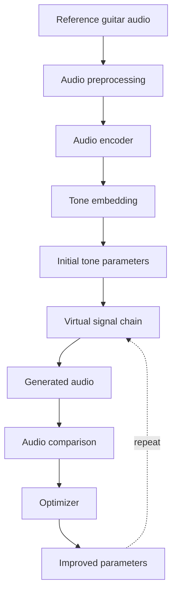
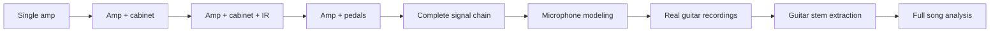
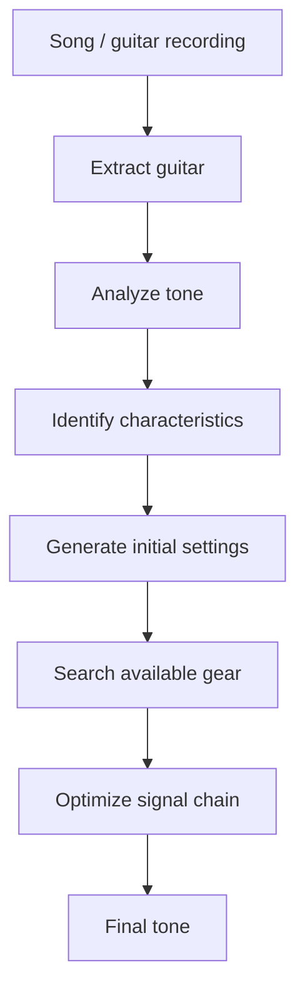
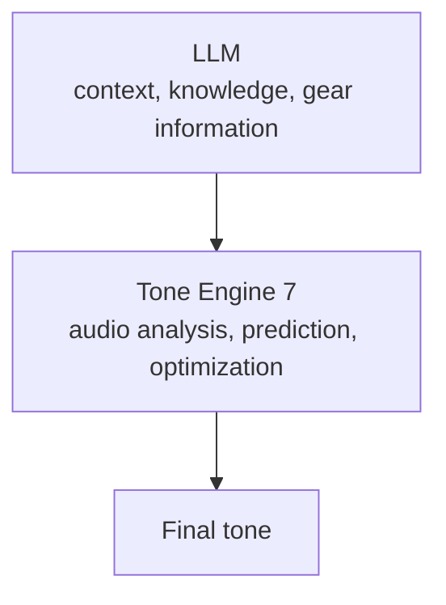

# Tone Engine 7

<p>
  
  
  
  
  
</p>

> An open-source neural audio engine for understanding, modeling, and matching guitar tones.

Tone Engine 7 is an experimental machine learning project built around one simple idea:

**Can we teach a computer to actually understand guitar tone?**

Most guitar tone tools rely on databases, predefined presets, or language models that generate plausible settings based on what they know about an artist or piece of gear.

Tone Engine 7 takes a different approach.

Instead of simply asking an AI what settings might sound good, the goal is to build a system that can **analyze audio mathematically, understand its tonal characteristics, generate a tone, compare the result against the original, and improve the settings automatically.**

---

## The Concept

A guitar recording is ultimately a signal.

That signal contains information about frequency content, harmonics, dynamics, distortion, transients, noise, spatial characteristics, and many other properties.

Tone Engine 7 treats that signal as data that a machine learning model can analyze.

The long-term concept looks like this:



The system does not need to get the perfect tone on its first attempt. Instead, it can make a prediction, render that prediction, measure how different it is from the reference, adjust the parameters, and try again. This turns guitar tone matching into an optimization problem.

### What Is a Tone?

For Tone Engine 7, a tone is not simply a collection of words such as:
- High gain
- Dark
- British
- Lots of mids

A tone can be represented as measurable audio information. For example:

```text
Gain:       0.72
Bass:       0.41
Mid:        0.68
Treble:     0.57
Presence:   0.52
Cabinet:    ...
Microphone: ...
Pedals:     ...
```

The exact representation will evolve as the project develops. The important concept is that the engine should learn the relationship between audio characteristics and the parameters that create them.

### The Neural "Ear"

Tone Engine 7 uses neural networks as its mathematical equivalent of an ear. The model does not hear music like a human; it receives numerical representations of audio and learns patterns within them. Given enough training data, the model can learn relationships between audio characteristics, distortion, frequency response, harmonic structure, dynamics, and the parameters that produce them. This allows the system to work from the sound itself instead of relying entirely on textual descriptions.

### Prediction Is Only the Beginning

A major principle of Tone Engine 7 is that prediction does not have to be perfect. Suppose the target tone was created using:

| Parameter | Value |
| :--- | :--- |
| **Gain** | 0.80 |
| **Bass** | 0.45 |
| **Mid** | 0.70 |
| **Treble** | 0.60 |

The neural network might initially predict:

| Parameter | Value |
| :--- | :--- |
| **Gain** | 0.74 |
| **Bass** | 0.49 |
| **Mid** | 0.65 |
| **Treble** | 0.57 |

Instead of treating that as the final answer, Tone Engine 7 can render the predicted settings and compare the resulting audio against the target. The optimizer can then search for a better configuration.

```text
Prediction -> Render -> Compare -> Calculate error -> Adjust parameters -> Render again -> Compare again -> Repeat
```

The objective is to minimize the difference between the generated tone and the reference.

---

## Audio Similarity

Comparing two guitar recordings is more complicated than comparing individual samples. Two signals can sound very similar while having different waveforms. Because of this, Tone Engine 7 is designed to experiment with multiple forms of audio comparison, including:

- **Spectral analysis**
- **STFT-based comparison**
- **Multi-resolution spectral loss**
- **Harmonic characteristics**
- **Dynamic characteristics**
- **Frequency response**
- **Learned audio embeddings**
- **Perceptual similarity metrics**

The goal is to find metrics that correlate with how humans actually perceive guitar tone.

---

## Starting Small

Tone Engine 7 is intentionally starting with a controlled environment. The first objective is not to analyze an entire commercial song and recreate its guitar rig. The first objective is much simpler:

> **Can a neural network listen to a guitar tone generated by a known system and recover the parameters that produced it?**

For example:

```text
Virtual Amplifier
       |
       +-- Gain
       +-- Bass
       +-- Mid
       +-- Treble
       +-- Presence
       +-- Master
```

The engine can generate thousands of tones from random parameter combinations. Each example contains:
- `audio.wav`
- `metadata.json`

The metadata contains the parameters that generated the audio. The model then learns:

**Audio → Parameters**

After training, it is tested on tones it has never seen before. If the model can successfully recover those parameters and reproduce the original sound, the foundation is working.

---

## Where This Can Go

Once the core system works, the same concept can be expanded.



Eventually, the system could work toward something like:



The goal is not necessarily to identify the exact equipment originally used to record a tone. If the original recording used a specific amplifier that the user does not own, the useful answer may be a completely different signal chain that produces an extremely similar result.

In other words: **The goal is to reproduce the sound, not simply identify the equipment.**

---

## Tone Engine 7 and LLMs

Tone Engine 7 is not intended to replace language models. Instead, an eventual system could combine both technologies.



- **LLM:** Understands requests, artists, songs, equipment, signal chains, and natural language.
- **Tone Engine 7:** Analyzes actual audio and performs the mathematical work required for tone matching.

This separation allows each system to focus on what it does best.

---

## Open Source

Tone Engine 7 is being developed as an open-source research project. The purpose is to experiment openly with:

- Neural audio models
- Guitar tone representations
- Synthetic datasets
- Amp and effects modeling
- Audio similarity
- Parameter prediction
- Optimization algorithms
- Perceptual audio analysis

The project is intentionally starting from the core engine. The user interface, SaaS platform, authentication, subscriptions, and other product features are separate concerns. 

*Build the engine first. Build the product later.*

---

## Project Status

**Status: Experimental / Early Research**

This project is still in its early stages. The architecture, models, datasets, and approaches may change significantly as experiments are performed.

The first major milestone is simple:
> Train a model that can analyze an unseen generated guitar tone, predict the parameters that created it, and reproduce that tone.

**First milestone: proven on a single virtual amp, including the optimization loop.** Stage 2 (signal chains) is in progress: an overdrive, amp, and cabinet chain is working, and the optimizer can now change which amp is in the chain as well as its knobs (see Experiment 2). Real recordings and song input are still ahead.

---

## Results: Experiment 1

A CNN was trained on 10,000 synthetic examples from one virtual amp (gain, bass, mid, treble, presence, master) and evaluated on 1,000 held-out examples it never saw during training. Per INSTRUCTIONS.md, the CNN's prediction is only meant to be a starting point: a CMA-ES search then refines it by rendering, scoring against the same multi-resolution STFT distance used throughout the project, and repeating. Every number and chart below comes straight out of `training/experiments/exp1_smoke/` (`evaluation/make_readme_charts.py` renders them; nothing here is hand-tuned).

| Metric | CNN prediction only | After optimization |
| :--- | :---: | :---: |
| Parameter mean absolute error (0-10 knob scale) | 0.80 | **0.38** |
| Audio similarity, reconstructed vs. reference | 0.65 | **0.92** |
| Test examples that improved after optimization | - | **99.7%** |

10,000 training examples, 1,000 held-out test examples, CMA-ES budget of 300 renders per example.

<table>
<tr>
<td width="50%">
<picture>
  <source media="(prefers-color-scheme: dark)" srcset="docs/assets/loss_curve_dark.png">
  
</picture>
</td>
<td width="50%">
<picture>
  <source media="(prefers-color-scheme: dark)" srcset="docs/assets/param_mae_dark.png">
  
</picture>
</td>
</tr>
<tr>
<td width="50%">
<picture>
  <source media="(prefers-color-scheme: dark)" srcset="docs/assets/audio_similarity_dark.png">
  
</picture>
</td>
<td width="50%">
<picture>
  <source media="(prefers-color-scheme: dark)" srcset="docs/assets/optimization_comparison_dark.png">
  
</picture>
</td>
</tr>
</table>

<picture>
  <source media="(prefers-color-scheme: dark)" srcset="docs/assets/reconstruction_example_dark.png">
  
</picture>

The example above is not a cherry-picked best case: it is the *median* test example by CNN-only audio similarity, so it represents typical performance rather than the easiest one. Note how much closer the third panel gets after optimization compared to the second.

That answers the milestone's actual question: yes, a network can recover this virtual amp's parameters from unseen audio, and a render-compare-adjust loop on top of its prediction gets substantially closer to the reference tone. What it does not yet cover: multiple amps, cabinets, IRs, pedals, or real recordings. Those are the next stages.

---

## Results: Experiment 2

Stage 2 of INSTRUCTIONS.md asks for multiple amps, cabinets, IRs, mic modeling, overdrive, EQ, compression, and a noise gate all at once. That is too much to prove in one step, so this is **Stage 2, increment 1**: an overdrive pedal (on or off) into one of 3 amp voicings into one of 4 synthetic cabinet IRs. Compression, a noise gate, mic modeling, and a separate EQ pedal are not in this increment yet.

The target is now a mix of continuous knobs (overdrive drive and level, gain, bass, mid, treble, presence, master) and discrete choices (which amp, which cabinet, whether the overdrive pedal is engaged), predicted by one CNN with multiple output heads. 10,000 training examples, evaluated on 1,000 held-out test examples.

| Metric | Result |
| :--- | :--- |
| Continuous knob mean absolute error (0-10 scale) | 2.07 |
| Cabinet identification accuracy (4 choices, chance = 25%) | **100%** |
| Amp identification accuracy (3 choices, chance = 33%) | 59% |
| Overdrive on/off accuracy (chance = 50%) | 61% |
| Audio similarity, CNN prediction only | 0.40 |

Cabinet identification is essentially solved, because a cabinet IR leaves a strong, distinctive spectral fingerprint. Amp and overdrive detection are only modestly above chance, honestly a weaker result than Experiment 1's clean single-amp case, likely because a low-drive overdrive pedal barely changes the audio at all (making "on" and "off" genuinely hard to tell apart from a short clip) and the three amp voicings partially overlap in the frequency ranges their EQ knobs cover. The training curve shows why the checkpoint was picked early: validation loss stops improving and gets noisy well before training loss does, i.e. the model overfits past epoch 15-20 on this harder task.

<table>
<tr>
<td width="50%">
<picture>
  <source media="(prefers-color-scheme: dark)" srcset="docs/assets/exp2_loss_curve_dark.png">
  
</picture>
</td>
<td width="50%">
<picture>
  <source media="(prefers-color-scheme: dark)" srcset="docs/assets/exp2_classification_accuracy_dark.png">
  
</picture>
</td>
</tr>
</table>

The optimization loop from Experiment 1 carries over here too, refining the continuous knobs with the discrete choices (amp, cabinet, overdrive on/off) held fixed at whatever the CNN predicted. Across all 1,000 test examples, with the same budget of 300 renders per example:

| Metric | CNN prediction only | After optimization |
| :--- | :---: | :---: |
| Continuous knob MAE (0-10 scale) | 2.07 | **1.47** |
| Audio similarity | 0.41 | **0.81** |
| Test examples that improved | - | **99.9%** |

That the continuous knobs can still be pushed this far even when roughly 40% of the amp choices and overdrive flags are wrong is itself informative: a wrong amp can often be partly compensated for by re-tuning the tone stack. Giving the same 300-render loop the *true* amp, cabinet, and overdrive state only reaches 0.83 on the same 1,000 examples, so at this budget the wrong choices cost about 0.03 of similarity.

<picture>
  <source media="(prefers-color-scheme: dark)" srcset="docs/assets/exp2_optimization_comparison_dark.png">
  
</picture>

<picture>
  <source media="(prefers-color-scheme: dark)" srcset="docs/assets/exp2_reconstruction_example_dark.png">
  
</picture>

### Letting the optimizer change the amp

The CNN picks the wrong amp about 4 times in 10, and the loop above never questions that choice. So the optimizer can now also try the other amps: it runs a CMA-ES search on each amp with 300 renders, keeps whichever reached the lowest loss, and spends the rest of the budget refining that one (`optimization/optimizer.py`, `optimize_with_choices`). The cabinet and overdrive calls stay as the CNN made them (see below for why).

Compared on the same 200 test examples, all at the same total budget of about 1,800 renders per example, with a run given the *true* amp, cabinet, and overdrive as a ceiling:

| | Audio similarity | Amp identified | Knob MAE (0-10) |
| :--- | :---: | :---: | :---: |
| CNN prediction only | 0.41 | 53.5% | 2.07 |
| Choices fixed, 300 renders | 0.81 | 53.5% | 1.47 |
| Choices fixed, 1,800 renders | 0.90 | 53.5% | 0.94 |
| **Amp search, 1,800 renders** | **0.93** | **74.5%** | **0.74** |
| True choices, 1,800 renders (ceiling) | 0.96 | 100% | 0.43 |

The amp search gains +0.028 similarity over keeping the CNN's choice at equal compute (95% bootstrap interval +0.018 to +0.040), which is about half the distance to the ceiling, and it raises amp identification from 53.5% to 74.5% using nothing but render-and-compare. The average hides a trade-off, though: on the 93 examples where the CNN's amp was wrong the search gains +0.081, while on the 107 where it was right it loses 0.018, because the winning amp only gets about 1,200 of the 1,800 renders instead of all of them. Example by example, the search beats keeping the CNN's choice on 43% of the test set and is slightly worse on the other 57% (some of that per-example spread is CMA-ES run-to-run randomness, see the note below). Only searching when the CNN is unsure of its amp call could keep most of the gain without that cost; that has not been tried yet.

<picture>
  <source media="(prefers-color-scheme: dark)" srcset="docs/assets/exp2_choice_search_dark.png">
  
</picture>

The schedule was picked on the validation split (100 examples per row), so the test set played no part in choosing it. Most of what was tried did not work:

| Search schedule (validation) | Renders | Audio similarity | Amp identified |
| :--- | :---: | :---: | :---: |
| Choices fixed | 310 | 0.820 | 56% |
| Top 6 amp/cabinet/overdrive combinations, 21 renders each, best 2 refined | 296 | 0.777 | 53% |
| Top 2 combinations, 101 renders each | 292 | 0.797 | 58% |
| Every amp, 61 renders each | 293 | 0.776 | 49% |
| True choices (ceiling) | 310 | 0.854 | 100% |
| Choices fixed | 1,810 | 0.911 | 56% |
| Top 6 combinations, 300 renders each | 1,796 | 0.890 | 85% |
| Every amp, 150 renders each | 1,793 | 0.905 | 54% |
| **Every amp, 300 renders each** | 1,793 | **0.935** | 78% |
| True choices (ceiling) | 1,810 | 0.964 | 100% |

Two lessons came out of this. First, **at a budget of 300 renders, every search schedule tried lost** to trusting the CNN. A short search on each candidate ranks them by how close each one happened to start, not by how close it could get, and whatever it does pick gets less refinement. Screening needs roughly 300 renders per candidate before it reliably separates the amps, so the search only pays off with a larger total budget. Second, **overdrive on/off is only weakly identifiable from the sound**: given the true amp and cabinet and 300 renders each, the true overdrive state reached the lower loss in only 62 of 100 validation examples. A low-drive pedal is mostly a level change, which the amp's gain knob can reproduce. Searching over it spends budget for little return, which is why the final search varies only the amp.

**Reproducibility note.** The `cma` library treats a seed of 0 as "seed from the clock", and the optimizer passed 0, so every optimization result above (and Experiment 1's) came from a randomly seeded search even though `--seed 0` was set. That is fixed now (`optimization/optimizer.py`, `_cma_seed`) and verified: two runs now match to 10 decimal places. The reported averages are still sound estimates, since each example was a genuine search with its own random seed. Two runs of the same 100 test examples before the fix differed by up to 0.15 similarity on single examples, while their averages differed by only 0.002. Rerunning the commands below will reproduce the averages within that noise, not the per-example values in the committed reports.

---

## Repository Layout

```text
audio/
    synth/         synthetic DI guitar source generation
    rendering/     Experiment 1's single virtual amp, plus Experiment 2's
                    overdrive/amp/cabinet signal chain (amp_models.py,
                    cabinets.py, chain_params.py, signal_chain.py)
    preprocessing/ wav I/O and normalization
    features/      log-mel spectrogram extraction
    similarity/    multi-resolution STFT audio similarity

models/
    tone_predictor/ audio -> parameters CNN (model.py) and the multi-head
                    audio -> signal chain predictor (chain_model.py)
    checkpoints/    trained weights (not versioned)

training/
    generate_dataset.py, generate_dataset_exp2.py   build a dataset from the renderer
    dataset.py, dataset_exp2.py                      torch Datasets over a generated dataset
    train.py, train_exp2.py                          training loops
    evaluate.py, evaluate_exp2.py                    held-out test set milestone reports

evaluation/     shared metrics, comparison plots, and README chart generation
                (make_readme_charts.py for Experiment 1, _exp2 for Experiment 2)
optimization/   CMA-ES refinement of the CNN's predicted parameters
                (evaluate_optimization.py / _exp2.py); for Experiment 2 the
                discrete choices can be held fixed, searched (every amp is
                tried, the best one refined), or set to the true ones as a
                ceiling (--mode fixed / search / oracle)
configs/        experiment configs
data/           generated datasets (not versioned)
```

### Running Experiment 1

```bash
python -m training.generate_dataset --n-examples 10000 --out-name exp1_smoke
python -m training.train --config configs/experiment1.yaml
python -m training.evaluate --config configs/experiment1.yaml --checkpoint best.pt
python -m optimization.evaluate_optimization --config configs/experiment1.yaml --n-examples 1000
python -m evaluation.make_readme_charts --run exp1_smoke
```

### Running Experiment 2

```bash
python -m training.generate_dataset_exp2 --n-examples 10000 --out-name exp2_smoke
python -m training.train_exp2 --config configs/experiment2.yaml
python -m training.evaluate_exp2 --config configs/experiment2.yaml --checkpoint best.pt
python -m optimization.evaluate_optimization_exp2 --config configs/experiment2.yaml --n-examples 1000
# amp search vs. fixed choices vs. the true-choice ceiling, all at 1800 renders per example
python -m optimization.evaluate_optimization_exp2 --config configs/experiment2.yaml --mode search --max-evals 1800 --n-examples 200 --tag b1800
python -m optimization.evaluate_optimization_exp2 --config configs/experiment2.yaml --mode fixed --max-evals 1800 --n-examples 200 --tag b1800
python -m optimization.evaluate_optimization_exp2 --config configs/experiment2.yaml --mode oracle --max-evals 1800 --n-examples 200 --tag b1800
python -m evaluation.make_readme_charts_exp2 --run exp2_smoke
```

---

## License

Tone Engine 7 is licensed under [Apache 2.0](LICENSE).
