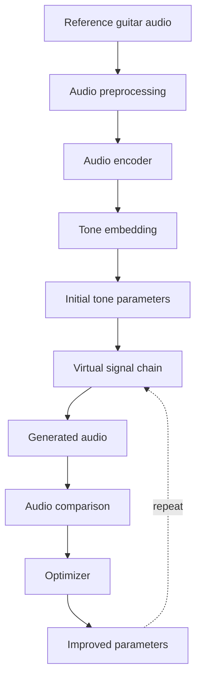
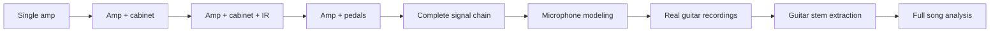
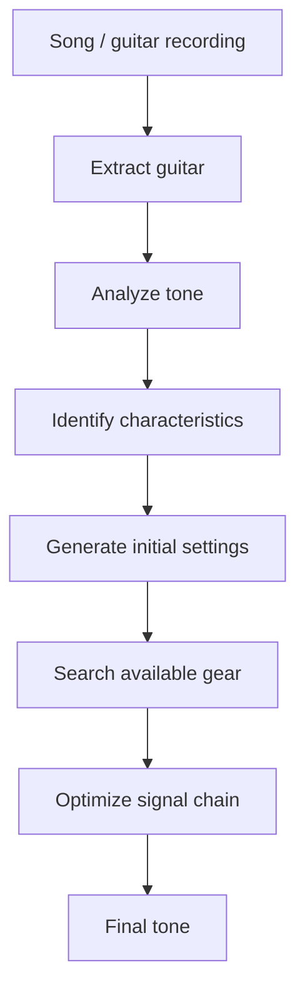
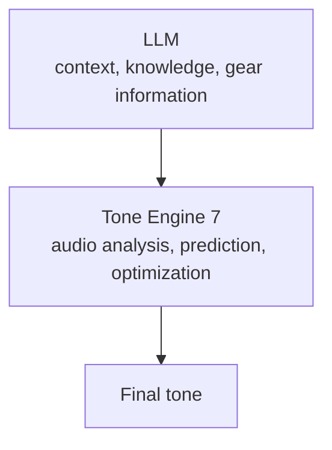

# Tone Engine 7

<p>
  
  
  
  
  
</p>

> An open-source neural audio engine for understanding, modeling, and matching guitar tones.

Tone Engine 7 is an experimental machine learning project built around one simple idea:

**Can we teach a computer to actually understand guitar tone?**

Most guitar tone tools rely on databases, predefined presets, or language models that generate plausible settings based on what they know about an artist or piece of gear.

Tone Engine 7 takes a different approach.

Instead of simply asking an AI what settings might sound good, the goal is to build a system that can **analyze audio mathematically, understand its tonal characteristics, generate a tone, compare the result against the original, and improve the settings automatically.**

---

## The Concept

A guitar recording is ultimately a signal.

That signal contains information about frequency content, harmonics, dynamics, distortion, transients, noise, spatial characteristics, and many other properties.

Tone Engine 7 treats that signal as data that a machine learning model can analyze.

The long-term concept looks like this:



The system does not need to get the perfect tone on its first attempt. Instead, it can make a prediction, render that prediction, measure how different it is from the reference, adjust the parameters, and try again. This turns guitar tone matching into an optimization problem.

### What Is a Tone?

For Tone Engine 7, a tone is not simply a collection of words such as:
- High gain
- Dark
- British
- Lots of mids

A tone can be represented as measurable audio information. For example:

```text
Gain:       0.72
Bass:       0.41
Mid:        0.68
Treble:     0.57
Presence:   0.52
Cabinet:    ...
Microphone: ...
Pedals:     ...
```

The exact representation will evolve as the project develops. The important concept is that the engine should learn the relationship between audio characteristics and the parameters that create them.

### The Neural "Ear"

Tone Engine 7 uses neural networks as its mathematical equivalent of an ear. The model does not hear music like a human; it receives numerical representations of audio and learns patterns within them. Given enough training data, the model can learn relationships between audio characteristics, distortion, frequency response, harmonic structure, dynamics, and the parameters that produce them. This allows the system to work from the sound itself instead of relying entirely on textual descriptions.

### Prediction Is Only the Beginning

A major principle of Tone Engine 7 is that prediction does not have to be perfect. Suppose the target tone was created using:

| Parameter | Value |
| :--- | :--- |
| **Gain** | 0.80 |
| **Bass** | 0.45 |
| **Mid** | 0.70 |
| **Treble** | 0.60 |

The neural network might initially predict:

| Parameter | Value |
| :--- | :--- |
| **Gain** | 0.74 |
| **Bass** | 0.49 |
| **Mid** | 0.65 |
| **Treble** | 0.57 |

Instead of treating that as the final answer, Tone Engine 7 can render the predicted settings and compare the resulting audio against the target. The optimizer can then search for a better configuration.

```text
Prediction -> Render -> Compare -> Calculate error -> Adjust parameters -> Render again -> Compare again -> Repeat
```

The objective is to minimize the difference between the generated tone and the reference.

---

## Audio Similarity

Comparing two guitar recordings is more complicated than comparing individual samples. Two signals can sound very similar while having different waveforms. Because of this, Tone Engine 7 is designed to experiment with multiple forms of audio comparison, including:

- **Spectral analysis**
- **STFT-based comparison**
- **Multi-resolution spectral loss**
- **Harmonic characteristics**
- **Dynamic characteristics**
- **Frequency response**
- **Learned audio embeddings**
- **Perceptual similarity metrics**

The goal is to find metrics that correlate with how humans actually perceive guitar tone.

---

## Starting Small

Tone Engine 7 is intentionally starting with a controlled environment. The first objective is not to analyze an entire commercial song and recreate its guitar rig. The first objective is much simpler:

> **Can a neural network listen to a guitar tone generated by a known system and recover the parameters that produced it?**

For example:

```text
Virtual Amplifier
       |
       +-- Gain
       +-- Bass
       +-- Mid
       +-- Treble
       +-- Presence
       +-- Master
```

The engine can generate thousands of tones from random parameter combinations. Each example contains:
- `audio.wav`
- `metadata.json`

The metadata contains the parameters that generated the audio. The model then learns:

**Audio → Parameters**

After training, it is tested on tones it has never seen before. If the model can successfully recover those parameters and reproduce the original sound, the foundation is working.

---

## Where This Can Go

Once the core system works, the same concept can be expanded.



Eventually, the system could work toward something like:



The goal is not necessarily to identify the exact equipment originally used to record a tone. If the original recording used a specific amplifier that the user does not own, the useful answer may be a completely different signal chain that produces an extremely similar result.

In other words: **The goal is to reproduce the sound, not simply identify the equipment.**

---

## Tone Engine 7 and LLMs

Tone Engine 7 is not intended to replace language models. Instead, an eventual system could combine both technologies.



- **LLM:** Understands requests, artists, songs, equipment, signal chains, and natural language.
- **Tone Engine 7:** Analyzes actual audio and performs the mathematical work required for tone matching.

This separation allows each system to focus on what it does best.

---

## Open Source

Tone Engine 7 is being developed as an open-source research project. The purpose is to experiment openly with:

- Neural audio models
- Guitar tone representations
- Synthetic datasets
- Amp and effects modeling
- Audio similarity
- Parameter prediction
- Optimization algorithms
- Perceptual audio analysis

The project is intentionally starting from the core engine. The user interface, SaaS platform, authentication, subscriptions, and other product features are separate concerns. 

*Build the engine first. Build the product later.*

---

## Project Status

**Status: Experimental / Early Research**

This project is still in its early stages. The architecture, models, datasets, and approaches may change significantly as experiments are performed.

The first major milestone is simple:
> Train a model that can analyze an unseen generated guitar tone, predict the parameters that created it, and reproduce that tone.

**First milestone: proven on a single virtual amp, including the optimization loop.** Everything after this milestone (multi-stage signal chains, real recordings, song input) is still ahead.

---

## Results: Experiment 1

A CNN was trained on 10,000 synthetic examples from one virtual amp (gain, bass, mid, treble, presence, master) and evaluated on 1,000 held-out examples it never saw during training. Per INSTRUCTIONS.md, the CNN's prediction is only meant to be a starting point: a CMA-ES search then refines it by rendering, scoring against the same multi-resolution STFT distance used throughout the project, and repeating. Every number and chart below comes straight out of `training/experiments/exp1_smoke/` (`evaluation/make_readme_charts.py` renders them; nothing here is hand-tuned).

| Metric | CNN prediction only | After optimization |
| :--- | :---: | :---: |
| Parameter mean absolute error (0-10 knob scale) | 0.80 | **0.38** |
| Audio similarity, reconstructed vs. reference | 0.65 | **0.92** |
| Test examples that improved after optimization | - | **99.7%** |

10,000 training examples, 1,000 held-out test examples, CMA-ES budget of 300 renders per example.

<table>
<tr>
<td width="50%">
<picture>
  <source media="(prefers-color-scheme: dark)" srcset="docs/assets/loss_curve_dark.png">
  
</picture>
</td>
<td width="50%">
<picture>
  <source media="(prefers-color-scheme: dark)" srcset="docs/assets/param_mae_dark.png">
  
</picture>
</td>
</tr>
<tr>
<td width="50%">
<picture>
  <source media="(prefers-color-scheme: dark)" srcset="docs/assets/audio_similarity_dark.png">
  
</picture>
</td>
<td width="50%">
<picture>
  <source media="(prefers-color-scheme: dark)" srcset="docs/assets/optimization_comparison_dark.png">
  
</picture>
</td>
</tr>
</table>

<picture>
  <source media="(prefers-color-scheme: dark)" srcset="docs/assets/reconstruction_example_dark.png">
  
</picture>

The example above is not a cherry-picked best case: it is the *median* test example by CNN-only audio similarity, so it represents typical performance rather than the easiest one. Note how much closer the third panel gets after optimization compared to the second.

That answers the milestone's actual question: yes, a network can recover this virtual amp's parameters from unseen audio, and a render-compare-adjust loop on top of its prediction gets substantially closer to the reference tone. What it does not yet cover: multiple amps, cabinets, IRs, pedals, or real recordings. Those are the next stages.

---

## Repository Layout

```text
audio/
    synth/         synthetic DI guitar source generation
    rendering/     the virtual amp (Experiment 1's ground truth renderer)
    preprocessing/ wav I/O and normalization
    features/      log-mel spectrogram extraction
    similarity/    multi-resolution STFT audio similarity

models/
    tone_predictor/ audio -> parameters CNN
    checkpoints/    trained weights (not versioned)

training/
    generate_dataset.py  builds a synthetic dataset from the virtual amp
    dataset.py            torch Dataset over a generated dataset
    train.py              training loop with parameter and audio-similarity validation
    evaluate.py            held-out test set milestone report

evaluation/     shared metrics, comparison plots, and README chart generation
optimization/   CMA-ES refinement of the CNN's predicted parameters
configs/        experiment configs
data/           generated datasets (not versioned)
```

### Running Experiment 1

```bash
python -m training.generate_dataset --n-examples 10000 --out-name exp1_smoke
python -m training.train --config configs/experiment1.yaml
python -m training.evaluate --config configs/experiment1.yaml --checkpoint best.pt
python -m optimization.evaluate_optimization --config configs/experiment1.yaml --n-examples 1000
python -m evaluation.make_readme_charts --run exp1_smoke
```

---

## License

Tone Engine 7 is licensed under [Apache 2.0](LICENSE).
